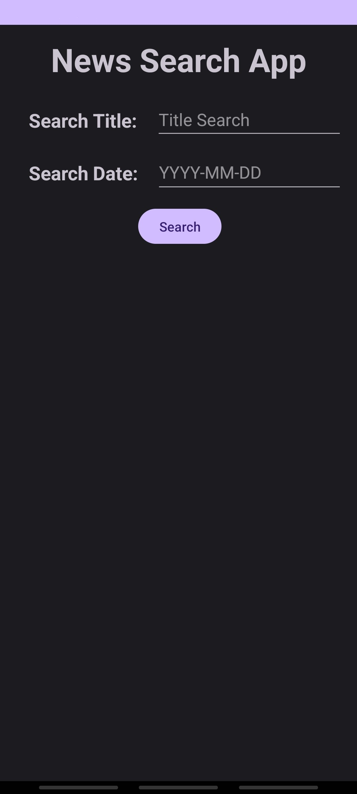
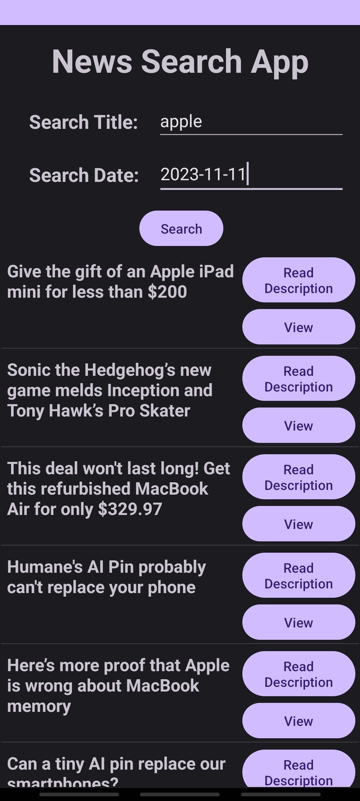

# NewsSearch Android App


## Overview

NewsSearch is an Android application that allows users to search for news articles based on keywords and date ranges. The app utilizes the News API to fetch real-time news data and provides a user-friendly interface for browsing and exploring news articles.

## Features

- **Search News:** Enter keywords and date range to search for relevant news articles.
- **View Details:** Tap on a news article to view details, including the title and a brief description.
- **Read Full Article:** Open the full article in a WebView for an immersive reading experience.
- **Text-to-Speech:** Listen to the article description using the built-in Text-to-Speech functionality.
- 
## Screenshots



## Getting Started

To run the NewsSearch app locally, follow these steps:

1. Clone the repository:

    ```bash
    git clone https://github.com/Kevcar98/NewsSearch.git
    ```

2. Open the project in Android Studio.

3. Build and run the app on an emulator or physical device.

## Dependencies

The project uses the following key dependencies:

- Retrofit: For making API requests and handling responses.
- Gson: For JSON serialization and deserialization.
- RecyclerView: For displaying a list of news articles.
- TextToSpeech: For reading out article descriptions.

For a complete list of dependencies, refer to the `build.gradle` files.

## API Key Configuration

The app requires an API key to access the News API. Obtain your API key from [News API](https://newsapi.org/) and add it to the Replace the one currently shown
